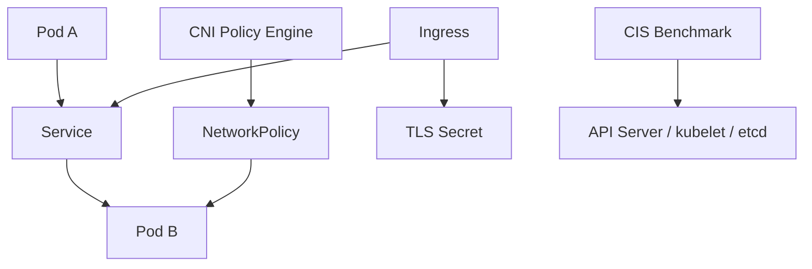

# 01. Cluster Setup

비중: 15%

Cluster Setup은 클러스터를 처음 만들거나 운영 기준을 세울 때 적용해야 하는 보안 기본값을 다룹니다. CKS v1.34에서는 NetworkPolicy, CIS benchmark, Ingress TLS, node metadata/endpoints 보호, platform binary 검증이 핵심입니다.

## 도메인 개요와 공격면

이 도메인의 핵심 질문은 "클러스터에 workload를 올리기 전에 어떤 기본 보안 경계를 만들어야 하는가"입니다. 기본 네트워크가 모두 허용이면 침해된 Pod가 다른 Pod나 외부 endpoint로 자유롭게 이동할 수 있고, TLS가 없는 Ingress는 트래픽 노출과 위조 위험을 키웁니다. CIS benchmark는 control plane, node, kubelet 설정이 알려진 보안 기준에서 벗어났는지 찾는 체크리스트입니다.

kind 실습에서는 모든 control plane 설정을 실제 시험처럼 바꾸기 어렵습니다. 대신 리소스 작성, 정책 의도, 검증 명령을 손에 익히고, kubeadm 기반 환경에서는 static Pod manifest와 host 파일 경로까지 확인하는 방식으로 이어가야 합니다.

## 핵심 개념 상세

### NetworkPolicy

NetworkPolicy는 Pod 간 ingress/egress 트래픽을 label selector로 제한하는 Kubernetes 표준 리소스입니다. 정책은 Service가 아니라 Pod를 선택합니다. `podSelector`는 정책을 적용받는 대상 Pod이고, `from`/`to`는 허용할 source 또는 destination입니다.

중요한 점은 NetworkPolicy 자체가 네트워크를 차단하지 않는다는 것입니다. CNI가 정책 강제를 지원해야 실제 차단이 일어납니다. 이 저장소는 Cilium을 기본 CNI로 사용하므로 표준 NetworkPolicy 실습 결과를 확인할 수 있습니다.

### CIS Benchmark

CIS benchmark는 "몇 점을 받는가"보다 "어떤 component의 어떤 설정이 왜 위험한가"를 읽는 능력이 중요합니다. 예를 들어 anonymous auth, insecure port, 과도한 파일 권한, audit 미설정, etcd 암호화 미사용 같은 항목은 각각 인증 우회, 정보 노출, 권한 상승, 추적 실패, Secret 노출로 이어질 수 있습니다.

시험에서는 kube-bench 결과를 전부 외우기보다 `WARN`/`FAIL` 항목의 component, 설정 이름, 권장값을 빠르게 찾아 위험도를 설명하거나 수정 방향을 제시하는 형태가 나올 수 있습니다.

### Ingress TLS

Ingress TLS는 Ingress 리소스, TLS Secret, host 이름이 맞아야 동작합니다. Secret은 보통 `kubernetes.io/tls` type이고 `tls.crt`, `tls.key`를 포함합니다. Ingress의 `spec.tls.hosts`와 `spec.rules.host`가 어긋나면 인증서가 기대한 host에 적용되지 않거나 기본 인증서가 사용될 수 있습니다.

### Metadata Endpoints

Cloud metadata endpoint는 node나 workload가 cloud credential, instance identity, bootstrap 정보에 접근하는 경로입니다. 공격자가 Pod에서 metadata endpoint에 접근하면 cloud 권한 탈취로 이어질 수 있습니다. 환경마다 주소와 차단 방식이 다르므로, CKS에서는 "민감 endpoint 접근을 NetworkPolicy, firewall, admission, runtime 설정으로 제한해야 한다"는 패턴을 이해하는 것이 중요합니다.

### Platform Binary Verification

Kubernetes binary나 설치 파일은 checksum 또는 signature로 무결성을 확인해야 합니다. 다운로드한 파일이 위조되면 클러스터 전체가 공격자의 코드로 동작할 수 있습니다. `sha256sum`으로 digest를 비교하고, 제공되는 경우 서명 검증까지 확인합니다.

## Kubernetes 리소스와 컴포넌트 흐름



NetworkPolicy는 Service 앞에서 동작하는 방화벽이 아니라 Pod traffic을 CNI가 해석해 강제하는 정책입니다. Ingress TLS는 Ingress controller가 Secret을 읽어 외부 TLS endpoint를 구성하는 흐름입니다. CIS benchmark는 리소스가 아니라 component 설정을 점검합니다.

## 시험에서 나오는 작업 유형

- namespace에 default deny NetworkPolicy를 만들고 필요한 ingress/egress만 허용한다.
- Service port와 container port를 구분해 NetworkPolicy port를 작성한다.
- CIS benchmark 결과에서 위험한 항목을 찾고 수정 방향을 말한다.
- TLS Secret을 생성하고 Ingress에 연결한다.
- metadata endpoint 또는 민감 endpoint 접근을 제한하는 정책을 작성한다.
- Kubernetes binary checksum/signature를 검증한다.

## 자주 틀리는 YAML 필드와 명령

- `NetworkPolicy.spec.podSelector`: 정책 적용 대상 Pod를 고른다.
- `NetworkPolicy.spec.ingress[].from`: 허용할 source를 고른다.
- `NetworkPolicy.spec.egress[].to`: 허용할 destination을 고른다.
- `ports.port`: Service port가 아니라 대상 Pod의 container port일 수 있다.
- `Ingress.spec.tls[].hosts`: 인증서가 적용될 host와 일치해야 한다.
- `Secret.type`: TLS Secret은 `kubernetes.io/tls`를 사용한다.

## 실습 전에 손으로 확인할 명령

```bash
kubectl get networkpolicy -A
kubectl describe networkpolicy -n <namespace> <name>
kubectl get pod -n <namespace> --show-labels
kubectl get ingress -A
kubectl get secret -n <namespace> <name> -o yaml
kubectl explain networkpolicy.spec.ingress
sha256sum <binary>
curl -I https://<host>
```

## 실수 포인트

- NetworkPolicy는 CNI가 강제하지 않으면 효과가 없다.
- `podSelector`가 source를 고른다고 착각한다.
- Service port와 targetPort/containerPort를 혼동한다.
- egress default deny 후 DNS 허용을 잊는다.
- Ingress TLS Secret type, key 이름, host 이름이 맞는지 확인하지 않는다.
- CIS benchmark를 점수표처럼만 보고 실제 component 설정과 연결하지 못한다.
- cloud metadata endpoint는 환경마다 다르므로 주소만 외우고 차단 패턴을 놓친다.

## 연결 실습 순서

1. [NetworkPolicy](../../labs/01-cluster-setup/network-policy/README.md)
2. [CIS Benchmark](../../labs/01-cluster-setup/cis-benchmark/README.md)
3. [Ingress TLS](../../labs/01-cluster-setup/ingress-tls/README.md)
4. [Metadata Endpoints](../../labs/01-cluster-setup/metadata-endpoints/README.md)
5. [Platform Binary Verification](../../labs/01-cluster-setup/platform-binary-verification/README.md)

## 공식 문서 검색 키워드

- `Kubernetes NetworkPolicy`
- `Kubernetes Ingress TLS`
- `Kubernetes Secrets tls`
- `CIS Kubernetes Benchmark kube-bench`
- `cloud metadata endpoint network policy`
- `Kubernetes release checksum signature`
