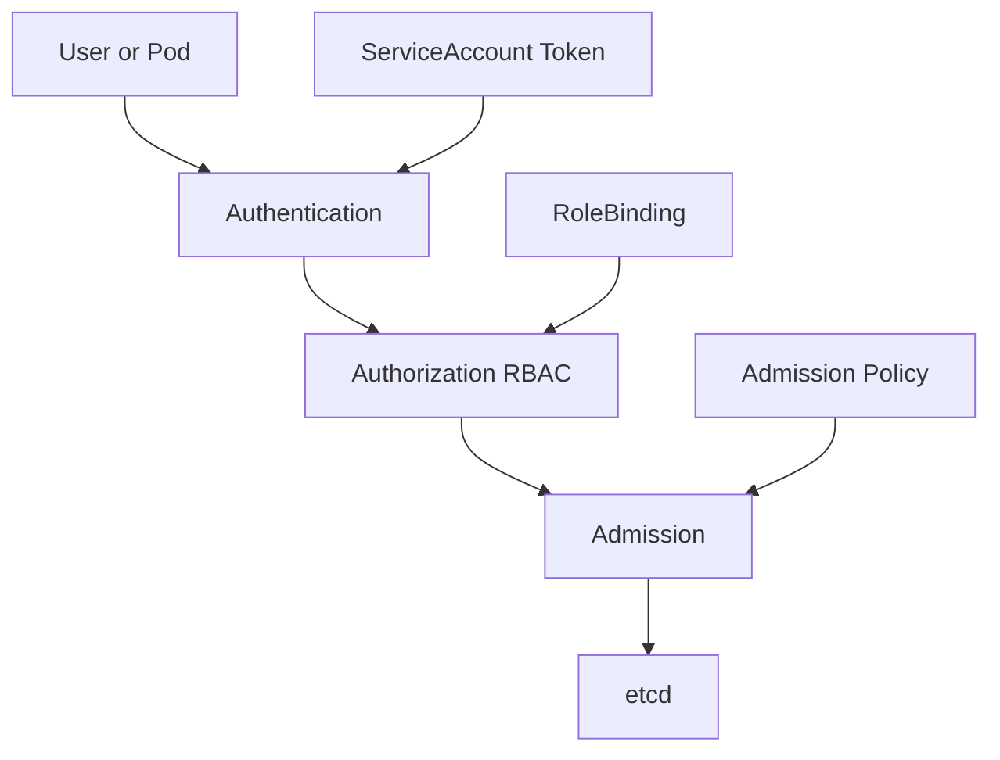

# 02. Cluster Hardening

비중: 15%

Cluster Hardening은 Kubernetes API와 권한 모델을 안전하게 제한하는 영역입니다. RBAC, ServiceAccount, API 접근 제한, 취약점 회피를 위한 upgrade가 핵심입니다.

## 도메인 개요와 공격면

이 도메인의 핵심은 "누가 Kubernetes API로 무엇을 할 수 있는가"를 최소화하는 것입니다. 공격자가 ServiceAccount token을 얻거나 과도한 RoleBinding을 악용하면 Secret 조회, Pod 생성, exec, privileged workload 배포로 이어질 수 있습니다. API server와 admission 설정은 요청이 저장되기 전 마지막 방어선이고, etcd는 Secret과 cluster state가 저장되는 민감한 저장소입니다.

Cluster Hardening 문제는 YAML 몇 줄을 고치는 것처럼 보이지만 실제로는 identity, authentication, authorization, admission, storage가 이어지는 흐름을 이해해야 빠르게 풀 수 있습니다.

## 핵심 개념

- RBAC는 `Role`, `ClusterRole`, `RoleBinding`, `ClusterRoleBinding`으로 권한을 부여한다.
- ServiceAccount는 Pod가 Kubernetes API에 접근할 때 사용하는 ID다.
- API server, admission controller, audit 설정은 요청이 저장되기 전후의 보안 경계다.
- etcd에는 Secret 등 민감한 데이터가 저장되므로 암호화와 백업 경로를 이해해야 한다.

## RBAC 권한 모델

RBAC는 "권한 정의"와 "권한 부여"가 분리됩니다. `Role`과 `ClusterRole`은 어떤 API group, resource, verb를 허용할지 정의합니다. `RoleBinding`과 `ClusterRoleBinding`은 그 권한을 user, group, ServiceAccount에 연결합니다.

- `Role`: 특정 namespace 안에서만 유효한 권한
- `ClusterRole`: cluster scope resource 또는 여러 namespace에서 재사용 가능한 권한
- `RoleBinding`: namespace 안에서 subject에게 Role 또는 ClusterRole을 연결
- `ClusterRoleBinding`: cluster 전체에 subject 권한을 부여

시험에서 가장 흔한 함정은 namespace 문제를 `ClusterRoleBinding`으로 풀어 권한을 과도하게 주는 것입니다. 문제에서 namespace가 지정되어 있으면 우선 `Role`/`RoleBinding`으로 풀 수 있는지 확인합니다.

## ServiceAccount Token

ServiceAccount는 Pod가 API server에 인증할 때 사용하는 identity입니다. Pod가 Kubernetes API를 호출할 필요가 없다면 `automountServiceAccountToken: false`를 고려합니다. token이 자동 마운트되면 container escape나 RCE 이후 공격자가 API server에 접근할 수 있는 출발점이 됩니다.

권한을 확인할 때는 실제 Pod 안에 들어가지 않아도 `kubectl auth can-i --as system:serviceaccount:<namespace>:<name>` 형식으로 검증할 수 있습니다.

## API Access와 Admission

API 요청은 대략 authentication, authorization, admission, persistence 순서로 처리됩니다. RBAC는 authorization 단계에서 "이 주체가 이 작업을 할 수 있는가"를 판단합니다. Admission controller는 저장 직전에 요청을 검증하거나 변경합니다. Pod Security Admission, ValidatingAdmissionPolicy, MutatingAdmissionWebhook 같은 기능은 이 단계에서 동작합니다.

문제에서 API server manifest를 다룬다면 `/etc/kubernetes/manifests/kube-apiserver.yaml` 같은 static Pod manifest를 수정하는 흐름을 떠올려야 합니다. kind에서는 이 흐름을 완전히 재현하기 어렵기 때문에 kubeadm 기반 환경에서 별도로 연습해야 합니다.

## etcd와 Upgrade

etcd는 cluster state와 Secret을 저장합니다. Secret은 Kubernetes API에서 base64로 표현될 뿐이며, etcd encryption at rest가 없으면 저장소 수준에서 평문에 가깝게 노출될 수 있습니다. CKS에서는 암호화 설정의 필요성, backup/restore 명령의 endpoint와 인증서 경로, 민감 데이터 보호 이유를 이해해야 합니다.

Upgrade는 기능 추가보다 보안 패치 관점에서 봅니다. 취약한 Kubernetes 버전, control plane component, node component를 확인하고, 시험에서는 직접 전체 upgrade를 수행하기보다 버전 확인과 위험 판단을 요구할 수 있습니다.

## 요청 처리 흐름



## 시험에서 나오는 작업

- Role/ClusterRole과 Binding을 최소 권한으로 구성한다.
- default ServiceAccount 사용을 피하고 token automount를 제한한다.
- Kubernetes API 접근 권한과 인증/인가 설정을 확인한다.
- 취약점 회피를 위한 upgrade 필요성을 판단한다.
- API server manifest에서 admission plugin, audit, authorization 관련 인자를 확인한다.
- etcd encryption 또는 backup/restore 명령의 구성 요소를 설명한다.

## 필수 명령

```bash
kubectl auth can-i <verb> <resource> --as system:serviceaccount:<ns>:<sa> -n <ns>
kubectl get role,rolebinding,clusterrole,clusterrolebinding -A
kubectl describe serviceaccount -n <namespace> <name>
kubectl get pod -n <namespace> <pod> -o jsonpath="{.spec.automountServiceAccountToken}"
kubectl get --raw /readyz
kubectl version
kubectl api-resources
kubectl explain role.rules
```

## 실수 포인트

- namespace 범위 문제에 `ClusterRoleBinding`을 사용해 권한을 과도하게 준다.
- ServiceAccount token 자동 마운트를 끄지 않는다.
- `apiGroups: [""]`를 빠뜨려 core resource 권한이 적용되지 않는다.
- `--as` 주체 형식을 잘못 입력해 권한 검증을 틀린다.
- control plane 정적 Pod manifest 경로와 일반 workload manifest를 혼동한다.
- `roleRef`의 namespace를 쓰려고 하거나 subject namespace를 빠뜨린다.
- Secret 조회 권한이 read-only처럼 보여도 매우 민감하다는 점을 낮게 평가한다.

## 자주 틀리는 YAML 필드

- `rules[].apiGroups`: core resource는 `[""]`
- `rules[].resources`: `pods`, `secrets`, `pods/exec`처럼 subresource 구분 필요
- `rules[].verbs`: `get`, `list`, `watch`, `create`, `delete`를 정확히 제한
- `subjects[].namespace`: ServiceAccount subject에는 namespace가 필요
- `roleRef`: 바인딩 후 변경 불가하므로 잘못 만들면 삭제 후 재생성
- `automountServiceAccountToken`: ServiceAccount 또는 Pod 수준에서 설정 가능

## 연결 실습

1. [RBAC and ServiceAccount](../../labs/02-cluster-hardening/rbac-serviceaccount/README.md)
2. [API Access](../../labs/02-cluster-hardening/api-access/README.md)
3. [Upgrade Security](../../labs/02-cluster-hardening/upgrade-security/README.md)

## 공식 문서와 추가 학습

- [Using RBAC Authorization](https://kubernetes.io/docs/reference/access-authn-authz/rbac/)
- [Service Accounts](https://kubernetes.io/docs/concepts/security/service-accounts/)
- [Admission Controllers](https://kubernetes.io/docs/reference/access-authn-authz/admission-controllers/)
- [Auditing](https://kubernetes.io/docs/tasks/debug/debug-cluster/audit/)
- [Encrypting Secret Data at Rest](https://kubernetes.io/docs/tasks/administer-cluster/encrypt-data/)

## 공식 문서 검색 키워드

- `Kubernetes RBAC rolebinding serviceaccount`
- `kubectl auth can-i as serviceaccount`
- `Kubernetes ServiceAccount automountServiceAccountToken`
- `Kubernetes admission controllers`
- `Kubernetes encrypt secret data at rest`
- `etcd backup restore Kubernetes`
