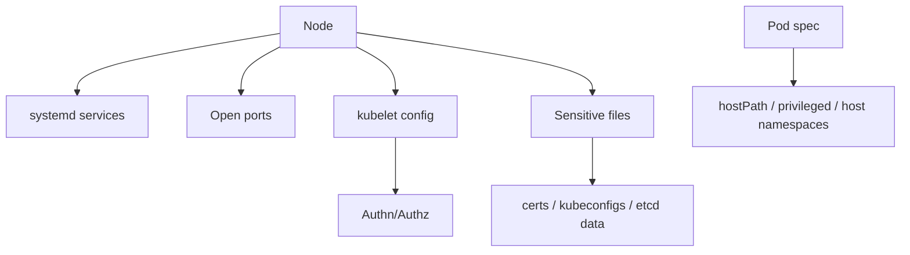

# 03. System Hardening

비중: 10%

System Hardening은 Kubernetes 리소스 밖의 노드와 운영체제 공격 표면을 줄이는 영역입니다. kubelet 설정, OS 서비스/포트 점검, least privilege, AppArmor/seccomp가 중요합니다.

## 도메인 개요와 공격면

Kubernetes 보안은 YAML만으로 끝나지 않습니다. kubelet, container runtime, systemd service, Linux kernel feature, host filesystem 권한이 모두 workload 격리와 연결됩니다. 공격자가 node에 접근하거나 privileged Pod를 통해 host namespace를 얻으면 Kubernetes API 권한이 없어도 로그, 인증서, kubelet 상태, container runtime socket을 통해 피해를 확장할 수 있습니다.

System Hardening 문제는 실제 노드에서 명령을 실행해 위험한 서비스, 열린 포트, 파일 권한, kubelet 설정을 찾는 형태로 나올 수 있습니다. kind에서는 host OS 하드닝을 완전히 재현하기 어렵지만, 어떤 설정을 찾아야 하는지와 어떤 위험으로 이어지는지 이해해야 합니다.

## 핵심 개념

- 노드에는 필요한 패키지와 systemd service만 유지한다.
- kubelet 접근은 인증과 인가가 적용되어야 하며 read-only port는 비활성화되어야 한다.
- 컨테이너 런타임과 노드 파일시스템 접근은 최소화한다.
- SSH, 열린 포트, 파일 권한은 클러스터 보안과 직접 연결된다.

## kubelet 보안

kubelet은 node에서 Pod 실행을 담당하는 핵심 component입니다. kubelet API가 인증 없이 열려 있거나 read-only port가 활성화되어 있으면 Pod 정보, 환경 변수, 볼륨, 노드 상태가 노출될 수 있습니다. 특히 anonymous auth, authorization mode, read-only port, client certificate 설정을 함께 봐야 합니다.

확인 위치는 환경마다 다릅니다. kubeadm 기반 노드에서는 kubelet config 파일, systemd unit, process argument를 모두 봐야 합니다. 설정 파일에는 안전한 값이 있어도 실제 systemd override에서 다른 flag가 들어갈 수 있습니다.

## Linux 노드 공격면

노드 하드닝은 "불필요한 것을 줄이는 작업"입니다. 실행 중인 service, 열린 port, 불필요한 package, 과도한 file permission, SSH 접근, container runtime socket 권한을 확인합니다. `/etc/kubernetes`, `/var/lib/kubelet`, `/var/lib/etcd`, `/etc/containerd` 같은 경로는 민감합니다.

시험에서 모든 보안 기준을 완벽하게 적용하기보다는, 명백히 위험한 서비스나 포트를 찾고 비활성화하거나 권한을 조정하는 작업이 나올 수 있습니다.

## AppArmor와 seccomp

seccomp는 system call을 제한합니다. 예를 들어 container가 필요 없는 syscall을 호출하지 못하게 해 kernel 공격면을 줄입니다. Kubernetes에서는 `securityContext.seccompProfile.type: RuntimeDefault` 같은 방식으로 적용합니다.

AppArmor는 Linux security module 기반으로 파일 접근, capability, 실행 경로 등을 profile로 제한합니다. Kubernetes에서는 node에 profile이 존재해야 하고, Pod annotation 또는 securityContext 방식이 Kubernetes 버전에 따라 다를 수 있습니다.

두 기능 모두 "컨테이너 내부 root가 host root와 같아지는 것을 막는 여러 방어선 중 하나"입니다. privileged, hostPID, hostNetwork, hostPath가 함께 열려 있으면 효과가 줄어듭니다.

## Host 접근 위험

`hostPath`, `privileged`, `hostPID`, `hostNetwork`, container runtime socket mount는 공격자가 host를 직접 다루게 만드는 대표적인 위험 설정입니다. System Hardening과 Microservice Vulnerabilities가 만나는 지점이기도 합니다. 시스템 하드닝에서는 host 수준 위험을 찾고, workload 하드닝에서는 그런 설정이 Pod에 들어가지 않도록 막습니다.

## 시험에서 나오는 작업

- kubelet read-only port, anonymous auth, authorization mode를 확인한다.
- 불필요한 systemd service와 열린 포트를 찾는다.
- 파일/소켓 권한을 최소화한다.
- seccomp 또는 AppArmor profile을 Pod에 적용한다.
- hostPath, privileged, host namespace 사용 workload를 찾아 위험을 설명한다.
- node 로그와 process 목록에서 의심 설정을 확인한다.

## 필수 명령

```bash
systemctl --type=service --state=running
journalctl -u kubelet --no-pager
ss -tulpn
ps aux
ls -l /var/lib/kubelet /etc/kubernetes
ls -l /var/run/containerd/containerd.sock /var/run/docker.sock
kubectl get pod <pod> -o yaml
kubectl get pods -A -o jsonpath="{range .items[*]}{.metadata.namespace}{' '}{.metadata.name}{' '}{.spec.hostNetwork}{' '}{.spec.hostPID}{'\n'}{end}"
```

## 노드 점검 흐름



먼저 열린 포트와 서비스로 외부 노출을 확인하고, kubelet 설정으로 노드 API 노출을 확인합니다. 그 다음 민감 파일 권한과 Pod의 host 접근 설정을 연결해서 실제 공격 경로를 판단합니다.

## 실수 포인트

- kind에서 재현되는 것과 실제 노드에서 해야 하는 systemd 작업을 혼동한다.
- kubelet config와 kubelet command line flag를 모두 확인하지 않는다.
- AppArmor/seccomp 설정 위치를 Pod와 container securityContext에서 혼동한다.
- read-only port만 보고 anonymous auth와 authorization mode를 놓친다.
- container runtime socket 권한이 곧 host 제어 권한으로 이어질 수 있음을 낮게 평가한다.
- AppArmor profile이 node에 없는데 Pod에만 profile 이름을 적는다.
- `hostPath`를 단순 volume으로 보고 민감 host 경로 노출을 놓친다.

## 자주 틀리는 YAML 필드와 설정

- `securityContext.seccompProfile.type`: `RuntimeDefault`, `Localhost`, `Unconfined`
- `securityContext.privileged`: 가능하면 `false`
- `hostPID`, `hostIPC`, `hostNetwork`: host namespace 공유 여부
- `volumes[].hostPath.path`: host filesystem 노출 경로
- kubelet `authentication.anonymous.enabled`: anonymous 접근 여부
- kubelet `authorization.mode`: `Webhook` 사용 여부
- kubelet `readOnlyPort`: 비활성화 필요

## 연결 실습

1. [Kubelet Hardening](../../labs/03-system-hardening/kubelet-hardening/README.md)
2. [Linux Surface Reduction](../../labs/03-system-hardening/linux-surface-reduction/README.md)
3. [AppArmor and seccomp](../../labs/03-system-hardening/apparmor-seccomp/README.md)
- [kubeadm control plane 대비 문서](../exam-env/kubeadm-control-plane.md)

## 공식 문서와 추가 학습

- [Security For Linux Nodes](https://kubernetes.io/docs/concepts/security/linux-kernel-security-constraints/)
- [Seccomp](https://kubernetes.io/docs/tutorials/security/seccomp/)
- [AppArmor](https://kubernetes.io/docs/tutorials/security/apparmor/)
- [Kubelet Configuration](https://kubernetes.io/docs/reference/config-api/kubelet-config.v1beta1/)
- [Node Authorization](https://kubernetes.io/docs/reference/access-authn-authz/node/)

## 공식 문서 검색 키워드

- `Kubernetes kubelet authentication authorization`
- `Kubernetes readOnlyPort kubelet`
- `Kubernetes seccomp RuntimeDefault`
- `Kubernetes AppArmor profile`
- `Kubernetes hostPath privileged hostPID`
- `Linux systemd list running services`
