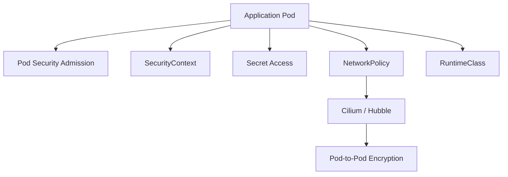

# 04. Minimize Microservice Vulnerabilities

비중: 20%

이 도메인은 애플리케이션 Pod의 실행 권한, Secret, 네트워크 격리, sandboxing, Pod-to-Pod encryption을 다룹니다.

## 도메인 개요와 공격면

이 도메인의 핵심은 "애플리케이션 Pod가 침해되더라도 피해 범위를 작게 유지하는가"입니다. 취약한 애플리케이션 자체를 완전히 없앨 수는 없으므로, Pod 실행 권한, Secret 접근, 네트워크 이동, runtime 격리, encryption으로 blast radius를 줄입니다.

공격자는 보통 container 내부 shell, 잘못 마운트된 Secret, 과도한 ServiceAccount, unrestricted network, root/privileged 실행을 조합합니다. 따라서 이 도메인은 여러 보안 기능을 따로 외우는 것보다 하나의 방어 흐름으로 이해해야 합니다.

## 핵심 개념

- Pod Security Admission(PSA)은 namespace label을 기준으로 Pod 보안 수준을 적용한다.
- SecurityContext는 Pod 또는 container 수준에서 실행 사용자, capability, read-only root filesystem 등을 지정한다.
- Secret은 base64 인코딩일 뿐 암호화가 아니며, 접근 권한과 마운트 방식이 중요하다.
- NetworkPolicy는 선택된 Pod에 적용되며, default deny 후 필요한 통신만 허용하는 방식이 안전하다.
- ServiceAccount token 자동 마운트는 Kubernetes API 접근이 필요한 Pod에만 허용한다.
- Cilium은 eBPF 기반 CNI로 NetworkPolicy 강제, CiliumNetworkPolicy, Hubble 관측성, Pod-to-Pod encryption 학습에 연결된다.

## Pod Security Admission

PSA는 namespace label을 기반으로 Pod 생성 요청을 검사합니다. `privileged`, `baseline`, `restricted` 수준이 있고, CKS에서는 `restricted` 기준을 자주 다룹니다. `enforce`는 실제 거부, `warn`은 경고, `audit`은 감사 기록을 남깁니다.

PSA는 "namespace에 정책을 걸어 새 Pod가 위험하게 생성되지 못하게 하는 장치"입니다. 이미 떠 있는 Pod를 자동으로 고치지는 않습니다. 그래서 거부 메시지와 event를 읽고 Pod spec의 부족한 필드를 수정하는 능력이 중요합니다.

## SecurityContext

SecurityContext는 Pod 또는 container가 어떤 권한으로 실행되는지 선언합니다. 자주 묶어서 봐야 하는 필드는 다음입니다.

- `runAsNonRoot`: root 실행 방지
- `runAsUser`: 실행 UID 지정
- `allowPrivilegeEscalation: false`: setuid 등 권한 상승 방지
- `capabilities.drop: ["ALL"]`: Linux capability 제거
- `readOnlyRootFilesystem: true`: root filesystem 변경 방지
- `seccompProfile.type: RuntimeDefault`: 기본 syscall 제한 적용

Pod level과 container level에 둘 수 있는 필드가 다르므로 `kubectl explain`으로 위치를 확인해야 합니다. `runAsNonRoot: true`만 넣어도 이미지가 root로만 실행되면 실패할 수 있습니다.

## Secret 관리

Secret은 Kubernetes API에서 base64로 표현됩니다. base64는 암호화가 아니라 인코딩이므로 Secret을 볼 수 있는 RBAC 권한은 민감합니다. Secret은 환경 변수보다 read-only volume으로 마운트하는 편이 노출면을 줄이는 경우가 많습니다. 환경 변수는 process inspection이나 debug 과정에서 노출될 수 있습니다.

etcd encryption at rest는 Secret 저장소 보호이고, RBAC는 API 조회 권한 제한이며, Pod volume mount는 workload 내부 노출 방식입니다. 세 가지 책임이 다르다는 점을 구분해야 합니다.

## NetworkPolicy와 격리

NetworkPolicy는 침해된 Pod가 다른 Pod나 namespace로 이동하는 것을 제한합니다. default deny를 먼저 적용하고 필요한 ingress/egress만 열어야 합니다. egress를 막을 때는 DNS가 필요한지 먼저 확인해야 합니다.

Cilium 환경에서는 표준 NetworkPolicy 외에 CiliumNetworkPolicy로 DNS, HTTP path, FQDN 같은 L7 조건을 실습할 수 있습니다. 단, CKS 핵심은 표준 Kubernetes 보안이고, Cilium L7 정책은 도메인 이해를 돕는 확장 주제로 다룹니다.

## RuntimeClass와 Sandbox

RuntimeClass는 Pod가 어떤 runtime handler로 실행될지 지정합니다. gVisor, Kata Containers 같은 sandbox runtime은 container와 host kernel 사이 격리를 강화할 수 있습니다. 단순히 YAML에 `runtimeClassName`을 쓰는 것만으로 동작하지 않고, cluster에 해당 runtime handler가 설치되어 있어야 합니다.

## Cilium Encryption

CKS v1.34에는 Cilium을 사용한 Pod-to-Pod encryption이 포함됩니다. encryption은 "누가 통신 가능한가"를 정하는 NetworkPolicy와 다릅니다. NetworkPolicy는 허용/차단, encryption은 허용된 통신의 보호 수준을 다룹니다. 실제 활성화 여부는 Cilium config와 status를 함께 확인해야 합니다.

## 시험에서 나오는 작업

- Pod Security Standards를 적용한다.
- Secret 접근 권한을 제한하고 안전한 사용 방식을 선택한다.
- namespace/NetworkPolicy/RuntimeClass로 격리를 강화한다.
- Cilium 기반 Pod-to-Pod encryption 흐름을 이해한다.

## 필수 명령

```bash
kubectl label ns <ns> pod-security.kubernetes.io/enforce=restricted
kubectl get pod <pod> -o yaml
kubectl get secret -n <ns>
kubectl auth can-i get secrets --as system:serviceaccount:<ns>:<sa> -n <ns>
kubectl get runtimeclass
kubectl get ciliumnetworkpolicy -A
kubectl -n kube-system rollout status ds/cilium
kubectl -n kube-system port-forward svc/hubble-ui 12000:80
```

`cilium`과 `hubble` CLI는 선택 도구입니다. 설치되어 있다면 `cilium hubble port-forward`와 `hubble observe --last 20`로 flow를 볼 수 있고, 없으면 Hubble UI로 대체합니다.

## NetworkPolicy와 CiliumNetworkPolicy

- `NetworkPolicy`: Kubernetes 표준 리소스, Pod/namespace selector 기반 L3/L4 제어
- `CiliumNetworkPolicy`: Cilium CRD, DNS, HTTP method/path, FQDN 등 고급 조건 지원
- `Hubble`: 정책 적용 결과와 flow를 관찰하는 도구

로컬 kind 기본 설치는 안정성을 위해 Cilium L7 proxy를 끕니다. HTTP path 기반 정책은 L7 proxy를 켠 환경에서 검증하고, CKS 핵심 범위는 표준 NetworkPolicy 문법과 허용/차단 검증에 집중합니다.

## 방어 흐름



PSA는 위험한 Pod 생성을 사전에 막고, SecurityContext는 실행 권한을 낮춥니다. Secret RBAC와 마운트 방식은 민감 데이터 노출을 줄이고, NetworkPolicy와 Cilium은 통신 범위를 제한하고 관찰합니다. RuntimeClass는 더 강한 격리가 필요한 workload에 적용합니다.

## 실수 포인트

- SecurityContext 필드를 Pod level과 container level에 잘못 둔다.
- Secret이 base64일 뿐 암호화가 아니라는 점을 놓친다.
- NetworkPolicy egress default deny 후 DNS 허용을 잊는다.
- sandboxed runtime은 RuntimeClass와 runtime handler가 모두 필요하다는 점을 놓친다.
- `runAsNonRoot: true`를 넣었지만 이미지가 root로만 실행되어 실패하는 경우를 놓친다.
- `readOnlyRootFilesystem: true`를 적용하고 필요한 writable volume을 준비하지 않는다.
- CNI가 준비되지 않은 상태에서 NetworkPolicy나 Cilium 정책을 테스트한다.
- Service port와 container port를 혼동한다.
- DNS egress를 막아놓고 FQDN 기반 테스트가 실패하는 이유를 놓친다.
- Hubble flow를 보지 않고 YAML만 보고 정책을 판단한다.
- `automountServiceAccountToken: false`가 필요한 Pod와 API 접근이 필요한 Pod를 구분하지 않는다.
- Secret을 base64로 보고 안전하다고 착각한다.
- RuntimeClass가 cluster runtime 설정 없이 YAML만으로 동작한다고 생각한다.

## 자주 틀리는 YAML 필드

- namespace label: `pod-security.kubernetes.io/enforce=restricted`
- `spec.securityContext.runAsNonRoot`
- `spec.containers[].securityContext.allowPrivilegeEscalation`
- `spec.containers[].securityContext.capabilities.drop`
- `spec.containers[].securityContext.readOnlyRootFilesystem`
- `spec.automountServiceAccountToken`
- `spec.runtimeClassName`
- `NetworkPolicy.spec.podSelector`
- `NetworkPolicy.spec.egress[].ports`
- `CiliumNetworkPolicy.spec.ingress[].toPorts[].rules.http`

## 연결 실습

1. [Pod Security](../../labs/04-microservice-vulnerabilities/pod-security/README.md)
2. [Secrets](../../labs/04-microservice-vulnerabilities/secrets/README.md)
3. [RuntimeClass Sandbox](../../labs/04-microservice-vulnerabilities/runtimeclass-sandbox/README.md)
4. [Cilium Encryption](../../labs/04-microservice-vulnerabilities/cilium-encryption/README.md)
5. [Cilium Policy](../../labs/04-microservice-vulnerabilities/cilium-policy/README.md)
6. [NetworkPolicy](../../labs/01-cluster-setup/network-policy/README.md)

## 공식 문서와 추가 학습

- [Pod Security Admission](https://kubernetes.io/docs/concepts/security/pod-security-admission/)
- [Pod Security Standards](https://kubernetes.io/docs/concepts/security/pod-security-standards/)
- [Configure a Security Context](https://kubernetes.io/docs/tasks/configure-pod-container/security-context/)
- [Good Practices for Kubernetes Secrets](https://kubernetes.io/docs/concepts/security/secrets-good-practices/)
- [Network Policies](https://kubernetes.io/docs/concepts/services-networking/network-policies/)
- [Service Accounts](https://kubernetes.io/docs/concepts/security/service-accounts/)
- [Cilium Installation Using Kind](https://docs.cilium.io/en/stable/installation/kind/)
- [Cilium Network Policy](https://docs.cilium.io/en/stable/security/policy/)
- [CiliumNetworkPolicy Reference](https://docs.cilium.io/en/stable/network/kubernetes/policy/)
- [Hubble Observability](https://docs.cilium.io/en/stable/observability/hubble/)

## 공식 문서 검색 키워드

- `Kubernetes Pod Security Admission restricted`
- `Kubernetes SecurityContext runAsNonRoot capabilities`
- `Kubernetes Secrets good practices`
- `Kubernetes NetworkPolicy egress DNS`
- `Kubernetes RuntimeClass`
- `Cilium encryption WireGuard`
- `CiliumNetworkPolicy HTTP path`
