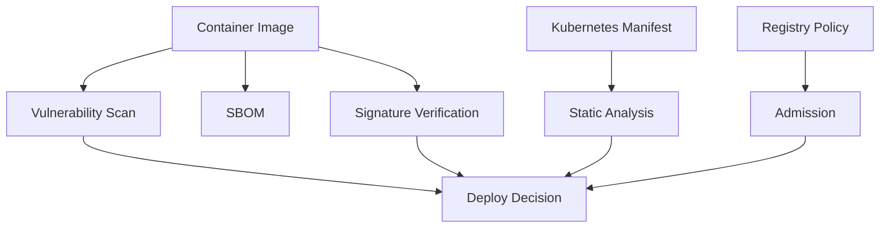

# 05. Supply Chain Security

비중: 20%

Supply Chain Security는 이미지와 manifest가 클러스터에 배포되기 전 신뢰할 수 있는지 확인하는 영역입니다. base image 최소화, SBOM, image signing, permitted registry, static analysis가 핵심입니다.

## 도메인 개요와 공격면

공급망 보안은 클러스터 안에서 실행되기 전 단계의 신뢰를 다룹니다. 취약한 base image, `latest` 태그, 검증되지 않은 registry, 서명되지 않은 이미지, 위험한 manifest가 그대로 배포되면 런타임 보안을 아무리 강화해도 시작점이 이미 불리합니다.

CKS에서는 빌드 파이프라인 전체를 구현하기보다, 주어진 이미지와 manifest를 검사하고 위험을 줄이는 실무형 작업이 중요합니다. 스캔 결과를 해석하고, tag/digest를 고정하고, non-root 실행 설정을 보완하고, admission 정책의 역할을 설명할 수 있어야 합니다.

## 핵심 개념

- 이미지 태그 `latest`는 재현성을 떨어뜨리므로 명시적 버전이나 digest를 사용한다.
- 취약점 스캔은 알려진 CVE를 찾는 작업이고, SBOM은 구성 요소 목록을 제공한다.
- 이미지 서명과 검증은 배포 전 신뢰 체인을 강화한다.
- Admission 정책은 허용된 registry, 서명된 이미지, root 실행 금지 같은 규칙을 강제할 수 있다.

## 이미지 하드닝

안전한 이미지는 작고, 목적이 분명하며, 불필요한 shell/package manager/tool이 적고, non-root 사용자로 실행할 수 있어야 합니다. 이미지 자체가 non-root로 설계되어 있지 않으면 Kubernetes에서 `runAsNonRoot: true`를 넣어도 실패할 수 있습니다.

`latest` 태그는 매번 다른 image digest를 가리킬 수 있어 재현성을 떨어뜨립니다. 시험에서는 `nginx:latest` 같은 이미지를 명시적 버전이나 digest로 바꾸고, 실행 권한을 제한하는 형태가 자주 나옵니다.

## Trivy와 취약점 스캔

Trivy 같은 도구는 이미지 안의 OS package, language dependency, known CVE를 찾습니다. 결과를 볼 때는 severity만 보지 말고 fixed version이 있는지, 실제 workload에서 해당 취약 코드 경로가 노출되는지, base image 변경이 가능한지까지 판단해야 합니다.

시험에서는 스캔 도구가 설치되어 있을 수 있고 없을 수도 있습니다. 도구가 있으면 빠르게 사용하고, 없으면 image tag, user, securityContext, manifest 위험을 수동으로 확인합니다.

## SBOM

SBOM은 Software Bill of Materials입니다. 취약점 목록이 아니라 구성 요소 목록입니다. CycloneDX나 SPDX 형식으로 어떤 package와 version이 포함되어 있는지 기록합니다. SBOM은 나중에 새로운 CVE가 공개되었을 때 어떤 이미지가 영향을 받는지 찾는 기반 자료입니다.

## Cosign과 이미지 서명

이미지 서명은 "이 이미지를 신뢰할 수 있는 주체가 만들었는가"를 확인합니다. digest 고정은 "항상 같은 이미지가 배포되는가"를 보장하고, 서명 검증은 "그 이미지가 신뢰된 producer의 산물인가"를 확인합니다. 둘은 서로 다른 문제를 해결합니다.

Cosign 검증은 registry, identity, certificate, transparency log 같은 요소와 연결됩니다. 시험에서는 완전한 PKI를 설계하기보다 서명 검증의 목적과 기본 명령 흐름을 이해하면 됩니다.

## Admission과 허용된 Registry

Permitted registry 정책은 workload가 승인된 registry의 이미지만 사용하도록 강제합니다. Kyverno, OPA Gatekeeper, ValidatingAdmissionPolicy 같은 도구에 따라 리소스 형태는 달라집니다. CKS에서는 특정 admission 도구가 주어졌다면 그 문법을 사용하고, 도구가 없으면 개념과 정책 목적을 설명하는 수준일 수 있습니다.

## Manifest 정적 분석

Kubesec, KubeLinter는 Kubernetes manifest에서 위험한 설정을 찾습니다. 예를 들어 privileged container, root 실행, `allowPrivilegeEscalation` 미설정, capability 미제거, resource limit 누락, `latest` 태그 사용을 지적할 수 있습니다. 중요한 것은 도구 출력에서 어떤 YAML 필드를 고쳐야 하는지 바로 연결하는 것입니다.

## 공급망 점검 흐름



이미지 스캔, SBOM, 서명 검증, manifest 분석은 서로 대체 관계가 아닙니다. 각각 취약점, 구성 요소, 출처 신뢰, 실행 설정 위험을 확인합니다.

## 시험에서 나오는 작업

- 이미지 취약점을 스캔하고 HIGH/CRITICAL 결과를 해석한다.
- `latest` 태그를 명시적 버전 또는 digest로 바꾼다.
- SBOM을 생성하거나 확인한다.
- Cosign으로 이미지 서명/검증 흐름을 설명한다.
- Kubesec/KubeLinter로 manifest 위험 설정을 찾는다.
- 허용된 registry만 사용하도록 admission 정책 개념을 설명한다.

## 필수 명령

```bash
trivy image <image>
trivy image --format cyclonedx --output sbom.json <image>
cosign verify <image>
kubesec scan <manifest.yaml>
kube-linter lint <path>
kubectl get pod <pod> -o jsonpath="{.spec.containers[*].image}"
kubectl get pod <pod> -o yaml
kubectl set image deployment/<name> <container>=<image>@sha256:<digest>
```

## 실수 포인트

- 스캔 결과만 보고 Kubernetes 실행 설정을 그대로 둔다.
- digest 고정과 서명 검증의 차이를 혼동한다.
- SBOM은 취약점 스캔 결과가 아니라 구성 요소 목록이라는 점을 놓친다.
- admission policy는 클러스터에 설치된 도구에 따라 리소스가 달라진다.
- `runAsNonRoot`와 이미지의 실제 USER 관계를 확인하지 않는다.
- `latest` 태그를 명시적 버전으로 바꿨지만 digest 고정이 필요한 상황을 놓친다.
- 정적 분석 도구의 경고를 보고도 어떤 YAML 필드를 고칠지 연결하지 못한다.

## 자주 틀리는 YAML 필드

- `spec.containers[].image`: tag와 digest 확인
- `spec.securityContext.runAsNonRoot`
- `spec.containers[].securityContext.allowPrivilegeEscalation`
- `spec.containers[].securityContext.capabilities.drop`
- `spec.containers[].securityContext.readOnlyRootFilesystem`
- `spec.containers[].resources.requests`
- `spec.containers[].resources.limits`
- admission policy의 registry match 조건

## 연결 실습

1. [Image Security](../../labs/05-supply-chain-security/image-security/README.md)
2. [SBOM](../../labs/05-supply-chain-security/sbom/README.md)
3. [Cosign Sign and Verify](../../labs/05-supply-chain-security/cosign-sign-verify/README.md)
4. [Kubesec and KubeLinter](../../labs/05-supply-chain-security/kubesec-kubelinter/README.md)
5. [Permitted Registries](../../labs/05-supply-chain-security/permitted-registries/README.md)

## 공식 문서와 추가 학습

- [Trivy Documentation](https://aquasecurity.github.io/trivy/)
- [Cosign Documentation](https://docs.sigstore.dev/cosign/)
- [Kubernetes Image Names](https://kubernetes.io/docs/concepts/containers/images/)
- [Validating Admission Policy](https://kubernetes.io/docs/reference/access-authn-authz/validating-admission-policy/)
- [Kubernetes Policies](https://kubernetes.io/docs/concepts/policy/)

## 공식 문서 검색 키워드

- `Kubernetes image names digest`
- `Trivy image scan CycloneDX SBOM`
- `Cosign verify image`
- `Kubesec scan Kubernetes manifest`
- `KubeLinter checks`
- `Kubernetes ValidatingAdmissionPolicy image registry`
