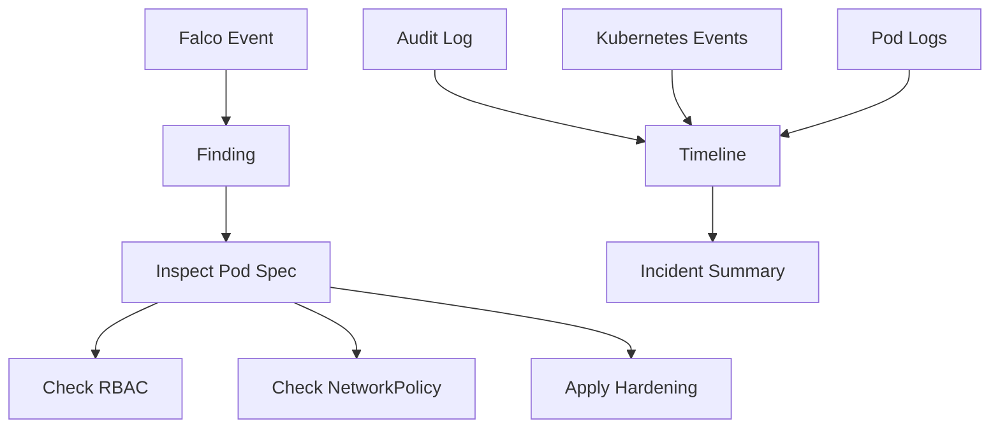

# 06. Monitoring, Logging and Runtime Security

비중: 20%

이 도메인은 audit log, runtime detection, incident investigation, runtime immutability를 다룹니다. CKS에서는 로그를 읽고 의심 workload를 찾아 개선 방향을 제시하는 능력이 중요합니다.

## 도메인 개요와 공격면

이 도메인은 "이미 실행 중인 클러스터에서 무슨 일이 일어났는지 알아낼 수 있는가"를 다룹니다. 예방 정책이 있어도 모든 공격을 막을 수는 없습니다. API 요청, 이벤트, Pod 로그, runtime 탐지 이벤트를 조합해 누가 무엇을 했고 어떤 리소스가 영향을 받았는지 추적해야 합니다.

Runtime security는 탐지와 대응입니다. Pod Security나 admission은 사전 차단에 가깝고, audit/Falco/log/event는 사후 관찰과 조사에 가깝습니다. 두 역할을 혼동하면 시험에서 "탐지 결과를 보고 어떤 설정을 고쳐야 하는가"를 놓치기 쉽습니다.

## 핵심 개념

- Kubernetes audit log는 누가 어떤 API 요청을 했는지 기록한다.
- Audit policy는 어떤 요청을 어느 수준으로 기록할지 결정한다.
- Runtime security 도구는 shell 실행, 민감 파일 접근, 패키지 설치 같은 컨테이너 내부 행위를 탐지한다.
- 탐지 후에는 관련 namespace, Pod, container, ServiceAccount, RBAC, NetworkPolicy를 함께 추적한다.
- Falco는 system call 기반 행위를 탐지하며 rule, priority, command, file path, namespace, pod를 함께 해석해야 한다.

## Audit Logging

Kubernetes audit log는 API server에 들어온 요청을 정책에 따라 기록합니다. audit policy는 resource, verb, user, namespace에 따라 어느 수준으로 기록할지 결정합니다.

대표 level은 다음과 같습니다.

- `None`: 기록하지 않음
- `Metadata`: 요청 metadata만 기록
- `Request`: 요청 body까지 기록
- `RequestResponse`: 요청과 응답 body까지 기록

`RequestResponse`는 조사에 유용하지만 Secret 같은 민감 데이터가 로그에 남을 수 있습니다. 따라서 Secret 요청은 보통 `Metadata` 수준으로 낮추고, ConfigMap이나 Pod 변경처럼 조사에 필요한 요청은 더 자세히 기록하는 식으로 조정합니다.

## Runtime Detection

Runtime detection은 container 내부에서 발생한 행위를 관찰합니다. shell 실행, `/etc/shadow` 읽기, package manager 실행, 예상치 못한 network tool 실행, Kubernetes token 접근 같은 이벤트는 침해 신호가 될 수 있습니다.

Falco는 system call 기반으로 이런 행위를 탐지합니다. 이벤트에는 rule, priority, output fields가 포함됩니다. CKS에서는 rule을 새로 깊게 작성하기보다 로그에서 namespace, pod, container, command, file path를 읽고 어떤 workload가 문제인지 찾는 능력이 중요합니다.

## Runtime Immutability

Runtime immutability는 실행 중인 container가 root filesystem을 변경하지 못하도록 제한하는 접근입니다. `readOnlyRootFilesystem: true`가 대표적입니다. 다만 애플리케이션이 쓰기 가능한 `/tmp`, cache, log 경로를 필요로 하면 `emptyDir` 같은 writable volume을 별도로 준비해야 합니다.

immutability는 탐지가 아니라 예방입니다. runtime 탐지 이벤트를 보고 재발 방지로 read-only filesystem, capability drop, non-root, NetworkPolicy를 적용하는 흐름을 연결해야 합니다.

## Incident Investigation

조사는 단일 명령이 아니라 순서입니다.

1. 이벤트에서 namespace, pod, container, command를 식별한다.
2. Pod spec에서 image, SecurityContext, ServiceAccount, volume, host 접근을 확인한다.
3. RBAC로 해당 ServiceAccount가 무엇을 할 수 있는지 확인한다.
4. NetworkPolicy와 egress 허용 범위를 확인한다.
5. 로그와 event로 시간 순서를 맞춘다.
6. 재발 방지 설정을 적용한다.

시험에서는 긴 포렌식보다 이 순서를 빠르게 말하고 필요한 YAML 필드를 수정하는 능력이 중요합니다.

## 시험에서 나오는 작업

- audit policy를 작성하고 API server에 연결하는 흐름을 이해한다.
- Falco 이벤트에서 의심 Pod와 command를 찾는다.
- runtime immutability를 위해 read-only root filesystem과 최소 권한을 적용한다.
- audit/event/log를 조합해 공격 흐름을 추적한다.

## 필수 명령

```bash
kubectl logs -n falco -l app.kubernetes.io/name=falco --since=10m
kubectl get events -A --sort-by=.lastTimestamp
kubectl describe pod -n <ns> <pod>
kubectl get pod -n <ns> <pod> -o yaml
journalctl -u kubelet --no-pager
kubectl auth can-i <verb> <resource> --as system:serviceaccount:<ns>:<sa> -n <ns>
kubectl get networkpolicy -n <ns>
```

## Falco 이벤트 해석

자주 보는 이벤트 유형:

- 컨테이너 내부 shell 실행
- 민감 파일 읽기(`/etc/shadow`, Kubernetes token 등)
- 예상하지 못한 네트워크 도구 실행
- 패키지 매니저 실행
- privileged 또는 host namespace 사용

Falco 이벤트를 보면 priority만 보지 말고 namespace, pod, container, command, file path를 먼저 식별합니다. 그 다음 해당 Pod의 SecurityContext, ServiceAccount, RBAC, NetworkPolicy를 확인해 탐지 원인을 차단 가능한 설정으로 연결합니다.

## 관찰과 대응 흐름



Audit log는 API 요청의 시간과 주체를 보여주고, Falco는 container 내부 행위를 보여줍니다. Kubernetes event와 Pod log는 상태 변화와 애플리케이션 출력을 보완합니다. 이 정보를 합쳐 원인과 대응을 정리합니다.

## 실수 포인트

- audit log level을 `RequestResponse`로 과하게 설정해 Secret 값이 남는다.
- Falco 이벤트의 priority만 보고 namespace/pod/container/command를 확인하지 않는다.
- 탐지와 차단을 혼동한다.
- read-only root filesystem을 켜고 필요한 writable path를 준비하지 않는다.
- Falco가 탐지 도구이지 admission controller가 아니라는 점을 혼동한다.
- Docker Desktop, Podman machine, Colima, Linux bare metal의 Falco driver 차이를 고려하지 않는다.
- audit policy에서 Secret을 `RequestResponse`로 기록해 민감 데이터를 남긴다.
- event와 log만 보고 ServiceAccount/RBAC/NetworkPolicy까지 추적하지 않는다.
- runtime 탐지 결과를 재발 방지 설정으로 연결하지 못한다.

## 자주 틀리는 YAML 필드와 설정

- audit policy `rules[].level`
- audit policy `rules[].resources`
- API server `--audit-policy-file`
- API server `--audit-log-path`
- `securityContext.readOnlyRootFilesystem`
- writable `emptyDir` volume과 `volumeMounts`
- `allowPrivilegeEscalation`, `capabilities.drop`, `runAsNonRoot`
- Falco Helm driver 설정과 namespace

## kind와 실제 클러스터 차이

kind의 노드는 Docker 또는 Podman container입니다. Falco는 host kernel과 driver에 영향을 받으므로 Windows/macOS Docker Desktop 또는 Podman machine에서는 Linux bare metal과 이벤트가 다르게 보일 수 있습니다. 실습에서는 이벤트 해석과 조사 흐름을 익히고, control plane audit 설정과 host-level runtime 탐지는 시험 유사 환경에서 다시 검증합니다.

## 연결 실습

1. [Audit Logging](../../labs/06-monitoring-logging-runtime/audit-logging/README.md)
2. [Audit Control Plane](../../labs/06-monitoring-logging-runtime/audit-control-plane/README.md)
3. [Runtime Investigation](../../labs/06-monitoring-logging-runtime/runtime-investigation/README.md)
4. [Falco Detection](../../labs/06-monitoring-logging-runtime/falco-detection/README.md)
5. [Runtime Immutability](../../labs/06-monitoring-logging-runtime/runtime-immutability/README.md)
6. [Incident Investigation](../../labs/06-monitoring-logging-runtime/incident-investigation/README.md)

## 공식 문서와 추가 학습

- [Kubernetes Auditing](https://kubernetes.io/docs/tasks/debug/debug-cluster/audit/)
- [Falco Documentation](https://falco.org/docs/)
- [Falco Installation on Kubernetes](https://falco.org/docs/setup/kubernetes/)
- [Falco Rules](https://falco.org/docs/rules/)
- [Falco Output Fields](https://falco.org/docs/reference/rules/supported-fields/)
- [Debug Running Pods](https://kubernetes.io/docs/tasks/debug/debug-application/debug-running-pod/)
- [Kubernetes Events](https://kubernetes.io/docs/reference/kubernetes-api/cluster-resources/event-v1/)

## 공식 문서 검색 키워드

- `Kubernetes auditing audit policy`
- `kube-apiserver audit-policy-file audit-log-path`
- `Falco rules output fields`
- `Kubernetes debug running pods`
- `Kubernetes events sort by lastTimestamp`
- `readOnlyRootFilesystem emptyDir`
